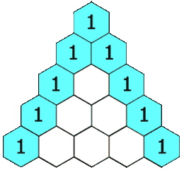

# Pascal_Triangle_2

Difficulty: Easy

# Question Description

Given an integer rowIndex, return the rowIndexth (0-indexed) row of the Pascal's triangle.

In Pascal's triangle, each number is the sum of the two numbers directly above it as shown:
 
Example 1:

Input: rowIndex = 3
Output: [1,3,3,1]

Example 2:
Input: rowIndex = 0
Output: [1]

Example 3:
Input: rowIndex = 1
Output: [1,1]
 
Constraints:

- 0 <= rowIndex <= 33

# Solution

[Pascal_Triangle_2]([119]Pascal_Triangle_2.py)
    
    