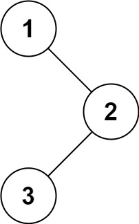

# Binary_Tree_Preorder_Traversal

Difficulty: Easy

# Question Description

Given the root of a binary tree, return the preorder traversal of its nodes' values.

Example 1:

Input: root = [1,null,2,3]
Output: [1,2,3]

Example 2:
Input: root = []
Output: []

Example 3:
Input: root = [1]
Output: [1]
 

Constraints:

- The number of nodes in the tree is in the range [0, 100].
- -100 <= Node.val <= 100

# Solution

[Binary_Tree_Preorder_Traversal]([144]Binary_Tree_Preorder_Traversal.py)
    
    